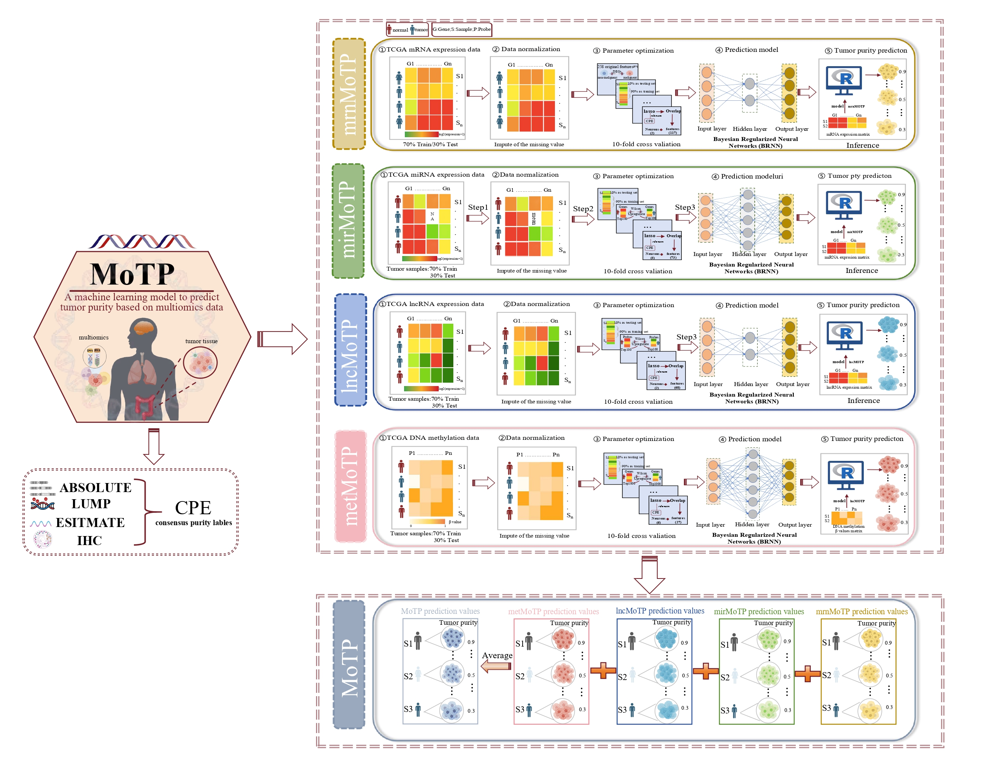

# MoTP

The machine learning Multi-Omics Tumor Purity Prediction (MoTP) algorithm introduces a novel method for accurately estimating tumor purity from any single type of transcriptomic and DNA methylation data (mRNA, microRNA, Long non-coding RNA, or DNA methylation)




&nbsp;
&nbsp;

# Description

A novel algorithm that integrates mRNA expression, DNA methylation, miRNA expression, and lncRNA expression data within a uniform machine-learning framework to predict tumor purity. Validated across TCGA pan-cancer datasets and various cancer cohorts, MoTP demonstrated superior performance compared to thirteen established algorithms, and higher accuracy than the algorithms based on a single omics data.


&nbsp;

# Details

+ The function `Preprocess()` is preprocessing a list of omics data frames or matrices. Including impute missing values and [0,1] scaled (maximum=1, minimum=0). This step is unnecessary; you can process the data yourself, as long as the data has no missing values and the range is scaled to [0,1].
+ The function `MoTP()` is used to predicts tumor purity from either single-omics or multi-omics data using pre-trained models.
  + "data_list" is a collection of omics data frames or matrices. Specifically, each  element in the list represents a different omics dataset, It is essential to ensure that row names are features and col names are samples. The sample names must remain consistent across all the omics datasets provided. The list must contain at least one omics dataset.
  + "omics_list" is a character vector indicating the type of each omics data in data_list. Default is c("mRNA", "miRNA", "lncRNA", "DNA-methylation"). Make sure the order is the same with "data_list".

&nbsp;
&nbsp;

# Installation

- You can install the released version of **MoTP** with:
  &nbsp;

```R
if (!requireNamespace("devtools", quietly = TRUE))
    install.packages("devtools")

devtools::install_github("Qiqi-MoTP/MoTP")
```

&nbsp;
&nbsp;

# Examples

&nbsp;
&nbsp;

## **Apply MoTP with omics data** 

### **Prepare data**

```R
library(MoTP)
file_path <- system.file("extdata", "example.RData", package = "MoTP")
load(file_path)
ls()
#"file_path"  "lncrna"  "methylation"  "mirna"  "mrna"
```


**mrna data**

```R
mrna[1:5,1:5]
```

| Gene_ID | 100130426 | 100133144 | 100134869 | 10357    | 10431     |
| ------- | --------- | --------- | --------- | -------- | --------- |
| **S1**  | 0.000000  | 2.5500141 | 2.636706  | 6.303383 | 6.300019  |
| **S2**  | 0.0000000 | 2.4765891 | 2.028675  | 6.303383 | 10.392884 |
| **S3**  | 0.4710313 | 1.9169734 | 2.475163  | 6.625719 | 10.671783 |
| **S4**  | 0.0000000 | 3.7624445 | 3.796764  | 6.300019 | 10.914296 |
| **S5**  | 0.0000000 | 0.9733541 | 0.000000  | 6.300019 | 10.053460 |


**mirna data**

```R
mirna[1:5,1:5]
```

|        | hsa-let-7a-1 | hsa-let-7a-1 | hsa-let-7a-1 | hsa-let-7b | hsa-let-7c |
| ------ | ------------ | ------------ | ------------ | ---------- | ---------- |
| **S1** | 14.43064     | 14.42567     | 14.42991     | 14.13457   | 12.55568   |
| **S2** | 14.16773     | 14.17590     | 14.18695     | 13.28409   | 11.83922   |
| **S3** | 13.36032     | 13.36814     | 13.35466     | 12.28092   | 10.40663   |
| **S4** | 12.94559     | 12.93629     | 12.95119     | 12.85132   | 8.19243    |
| **S5** | 14.07908     | 12.93629     | 14.07395     | 14.36202   | 10.28470   |


**lncrna data**

```R
lncrna[1:5,1:5]
```

|      | LINC01587 | AC000111.6 | XXbac-B461K10.4 | IGF2-AS  | TPTEP1   |
| ---- | --------- | ---------- | --------------- | -------- | -------- |
| S1   | 1.584963  | 0          | 2.000000        | 9.294621 | 10.70908 |
| S2   | 1.000000  | 0          | 3.807355        | 9.665336 | 10.05799 |
| S3   | 5.357552  | 0          | 2.807355        | 1.584963 | 10.67772 |
| S4   | 4.584963  | 0          | 2.807355        | 9.523562 | 3.00000  |
| S5   | 0.000000  | 0          | 1.584963        | 2.000000 | 5.83289  |

&nbsp;

**methylation data**

```R
methylation[1:5,1:5]
```


|      | cg13332474 | cg13332474 | cg17027195 | cg09868354 | cg03050183 |
| ---- | ---------- | ---------- | ---------- | ---------- | ---------- |
| S1   | 0.0317     | 0.0244     | 0.0678     | 0.1086     | 0.0739     |
| S2   | 0.0327     | 0.0254     | 0.0549     | 0.0878     | 0.0485     |
| S3   | 0.0208     | 0.0218     | 0.0382     | 0.0581     | 0.0770     |
| S4   | 0.0207     | 0.0219     | 0.0284     | 0.0393     | 0.0752     |
| S5   | 0.0276     | 0.0226     | 0.0472     | 0.0652     | 0.0605     |


## Apply MoTP to single omics data

```R
data_list = list(mrna)
data_pre = Preprocess(data_list)
Purity = MoTP(data_pre, omics_list = c("mRNA"))
```

&nbsp;
&nbsp;


## **Apply MoTP to multi-omics data**


```R
data_list = list(mrna,mirna,lncrna,methylation)
data_pre = Preprocess(data_list)
Purity = MoTP(data_pre, omics_list = c("mRNA", "miRNA", "lncRNA", "DNA-methylation"))
```


&nbsp;
# Contact

E-mail any questions to Xiaosheng Wang (xiaosheng.wang@cpu.edu.cn)
